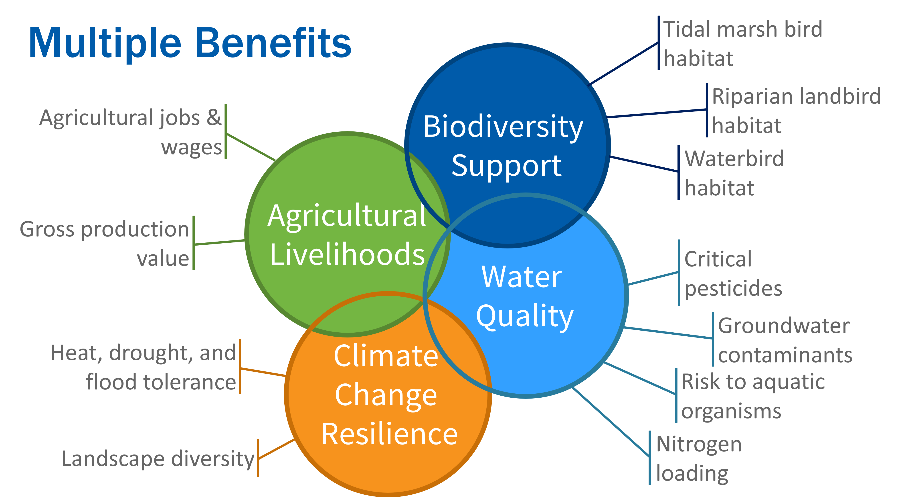

<!-- README.md is generated from README.Rmd. Please edit that file -->


# DeltaMultipleBenefits

<!-- badges: start -->

[](https://zenodo.org/badge/latestdoi/380353580)
[](https://github.com/pointblue/DeltaMultipleBenefits)
[-blue.svg)](https://cran.r-project.org/web/licenses/GPL%20(%3E=%203))
[](https://www.repostatus.org/#active)

<!-- badges: end -->

## Introduction

The `DeltaMultipleBenefits` R package serves as an open-source,
science-based framework for estimating the net impacts of scenarios of
landscape change on multiple metrics of interest. It is intended to
support land use planning, management, conservation, and community
engagement in the Sacramento-San Joaquin River Delta by identifying
potential benefits and trade-offs of proposed or anticipated changes in
land cover.

## Installation

<!--You can install the released version of DeltaMultipleBenefits from [CRAN](https://CRAN.R-project.org) with:
&#10;``` r
install.packages("DeltaMultipleBenefits")
```
&#10;And the development version from [GitHub](https://github.com/) with:-->

You can install the development version from
[GitHub](https://github.com/) with:

``` r
# install.packages("devtools")
devtools::install_github("pointblue/DeltaMultipleBenefits")
```

## How to use

This package provides tools for evaluating land cover rasters supplied
by the user to estimate the magnitude of the benefits associated with
each landscape and the differences in benefits among landscapes, such as
between current baseline land cover and a proposed or anticipated
alternative land cover.

### Benefit Categories and Metrics

The benefit categories currently addressed include: Agricultural
Livelihoods, Water Quality, Climate Change Resilience, and Biodiversity
Support. Each category is represented by multiple metrics:



*This framework is still in development and designed to readily
incorporate additional species, models, data, and metrics. Please
contact us to collaborate on incorporating additional metrics or data.*

### Scenarios & Alternative Landscapes

By comparing landscape totals for each metric estimated from a baseline
landscape and alternative landscapes representing proposed or
anticipated changes, the expected direction and magnitude of the net
change in each metric is estimated. In the initial development of this
framework, we built simple alternative landscapes representing changes
driven by one or two individual drivers of landscape change, allowing
evaluation of their individual impacts. However, more complex and
realistic scenarios of future landscape change can also be evaluated.

### Evaluating New Scenarios

This package includes a [vignette](articles/DeltaMultipleBenefits.html)
that serves as a tutorial outlining the major steps of analyzing
alternative Delta landscapes and comparing them to each other,
including:

1.  Preparing new landscape scenarios for analysis
2.  Summarizing the net change in the total area of each land cover
    class
3.  Estimating the net change in simple metrics
4.  Estimating the net change in metrics informed by spatial models

## For more information

- [Project Overview](articles/overview.html): Prior and current phases
  of this project’s development
- [Supporting Information](articles/supporting_information.html):
  Reports, publications, and data sets including all previously
  developed metrics, models, spatial data, and alternative landscapes.

## Funding Statement

These data were originally developed as part of the project *Trade-offs
and Co-benefits of Landscape Change on Bird Communities and Ecosystem
Services in the Sacramento–San Joaquin River Delta*, funded by
Proposition 1 Delta Water Quality and Ecosystem Restoration Program,
Grant Agreement Number – Q1996022, administered by the California
Department of Fish and Wildlife.

A second phase of development is currently underway, *Trade-offs and
Co-benefits of Landscape Change in the Sacramento-San Joaquin River
Delta: Phase II Tidal Wetlands and Restoration*, funded by the Water
Quality, Supply, and Infrastructure Improvement Act of 2014 (Proposition
1, CWC § 79707), grant agreement number Q2296017, administered by the
California Department of Fish and Wildlife.
