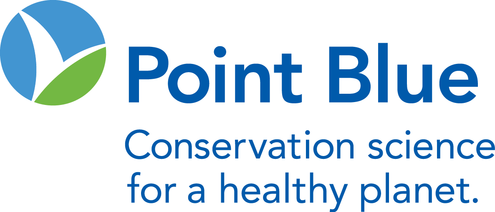

<!-- README.md is generated from README.Rmd. Please edit that file -->



# DeltaMultipleBenefits

<!-- badges: start -->

[](https://zenodo.org/badge/latestdoi/380353580)
[](https://github.com/pointblue/DeltaMultipleBenefits)
[-blue.svg)](https://cran.r-project.org/web/licenses/GPL%20(%3E=%203))
[](https://www.repostatus.org/#active)

<!-- badges: end -->

## Introduction

The `DeltaMultipleBenefits` R package serves as an open-source,
science-based framework for estimating the net impacts of scenarios of
landscape change on multiple metrics of interest. It is intended to
support land use planning, management, conservation, and community
engagement in the Sacramento-San Joaquin River Delta by identifying
potential benefits and trade-offs of proposed or anticipated changes in
land cover.

**Your help is needed! We are currently seeking input on approaches to
developing tidal wetland restoration scenarios. Please see [our recent
article](articles/tidal_wetland_restoration.html) for more
information.**

## Installation

<!--You can install the released version of DeltaMultipleBenefits from [CRAN](https://CRAN.R-project.org) with:
&#10;``` r
install.packages("DeltaMultipleBenefits")
```
&#10;And the development version from [GitHub](https://github.com/) with:-->

You can install the development version from
[GitHub](https://github.com/) with:

``` r
# install.packages("devtools")
devtools::install_github("pointblue/DeltaMultipleBenefits")
```

## How to use

This package provides tools for evaluating land cover rasters supplied
by the user to estimate the magnitude of the benefits associated with
each landscape and the differences in benefits among landscapes, such as
between current baseline land cover and a proposed or anticipated
alternative land cover.

### Benefit Categories and Metrics

The benefit categories currently addressed include: Agricultural
Livelihoods, Water Quality, Climate Change Resilience, and Biodiversity
Support. Each category is represented by multiple metrics:


All metrics are currently one of two types:

- **simple metrics:** quantitative values or qualitative scores assigned
  to each land cover class and summarized over the entire landscape

- **spatial models:** models that require information about the spatial
  distribution of land covers to estimate a total value, such as the
  total suitable habitat estimated from a species distribution model

All simple metrics and species distribution models that have already
been developed for this framework are available for download:

> <a href="https://doi.org/10.5281/zenodo.7504874"
> target="_blank"></a>
> Metrics Data for Quantifying Multidimensional Impacts of Landscape
> Change in California’s Sacramento–San Joaquin Delta. DOI:
> 10.5281/zenodo.7504874 *(also included in the `DeltaMultipleBenefits`
> package)*
>
> <a href="https://doi.org/10.5281/zenodo.7531945"
> target="_blank"></a>
> Distribution models for riparian landbirds and waterbirds in the
> Sacramento-San Joaquin Delta. DOI: 10.5281/zenodo.7531945

*This framework is still in development and designed to readily
incorporate additional species, models, data, and metrics. Please
contact us to collaborate on incorporating additional metrics or data.*

### Scenarios & Alternative Landscapes

By comparing landscape totals for each metric estimated from a baseline
landscape and alternative landscapes representing proposed or
anticipated changes, the expected direction and magnitude of the net
change in each metric is estimated. In the initial development of this
framework, we built simple alternative landscapes representing changes
driven by one or two individual drivers of landscape change, allowing
evaluation of their individual impacts. However, more complex and
realistic scenarios of future landscape change can also be evaluated.

All landscapes that have already been developed for this framework are
available for download, including a baseline landscape, a restoration
landscape representing Delta Plan restoration targets for non-tidal
wetlands and riparian habitat, a perennial crop expansion landscape, and
a combination of restoration and perennial crop expansion.

> <a href="https://apps.wildlife.ca.gov/bios6/?bookmark=356"
> target="_blank"></a>
> Baseline and projected future land use and land cover in the
> Sacramento-San Joaquin Delta *(including predicted presence of focal
> taxa under baseline conditions)*

### Evaluating New Scenarios

This package includes a vignette that serves as a tutorial outlining the
major steps of analyzing alternative Delta landscapes and comparing them
to each other, including:

1.  Preparing new landscape scenarios for analysis
2.  Summarizing the net change in the total area of each land cover
    class
3.  Estimating the net change in simple metrics
4.  Estimating the net change in metrics informed by spatial models

## Supporting Information

> Dybala KE, Sesser K, Reiter M, Hickey C, Gardali T. 2023. *Final
> Project Report: Trade-offs and Co-benefits of Landscape Change
> Scenarios on Bird Communities and Ecosystem Services in the
> Sacramento-San Joaquin River Delta.* Point Blue Conservation Science,
> Petaluma, CA<br> <a
> href="https://www.kristendybala.com/files/Dybala2023_DeltaMultipleBenefits_Report.pdf"
> target="_blank"></a>
>
> Dybala K, Sesser K, Reiter M, Shuford WD, Golet GH, Hickey C, Gardali
> T (2023) Priority Bird Conservation Areas in California’s
> Sacramento–San Joaquin Delta. San Francisco Estuary and Watershed
> Science 21(3). DOI:
> [10.15447/sfews.2023v21iss3art4](https://doi.org/10.15447/sfews.2023v21iss3art4)<br>
> <a
> href="https://www.kristendybala.com/files/Dybala2023_PriorityBirdConservationAreas.pdf"
> target="_blank"></a>
>
> Dybala KE, Reiter ME, Hickey CM (*In press*) Multiple-benefit
> Conservation in Practice: A Framework for Quantifying
> Multi-dimensional Impacts of Landscape Change in California’s
> Sacramento–San Joaquin Delta. San Francisco Estuary and Watershed
> Science.
>
> <a href="https://doi.org/10.5281/zenodo.7672193"
> target="_blank"></a>
> Supplemental Spatial Data for Quantifying Multidimensional Impacts of
> Landscape Change in California’s Sacramento–San Joaquin Delta. DOI:
> 10.5281/zenodo.7672193

## Funding Statement

These data were originally developed as part of the project *Trade-offs
and Co-benefits of Landscape Change on Bird Communities and Ecosystem
Services in the Sacramento–San Joaquin River Delta*, funded by
Proposition 1 Delta Water Quality and Ecosystem Restoration Program,
Grant Agreement Number – Q1996022, administered by the California
Department of Fish and Wildlife.

A second phase of development is currently underway, *Trade-offs and
Co-benefits of Landscape Change in the Sacramento-San Joaquin River
Delta: Phase II Tidal Wetlands and Restoration*, funded by the Water
Quality, Supply, and Infrastructure Improvement Act of 2014 (Proposition
1, CWC § 79707), grant agreement number Q2296017, administered by the
California Department of Fish and Wildlife.
