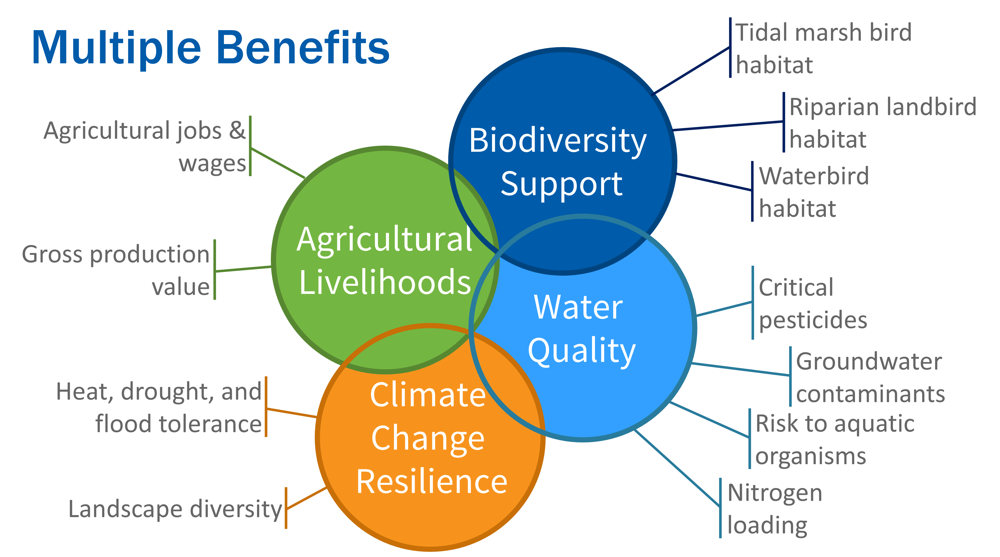
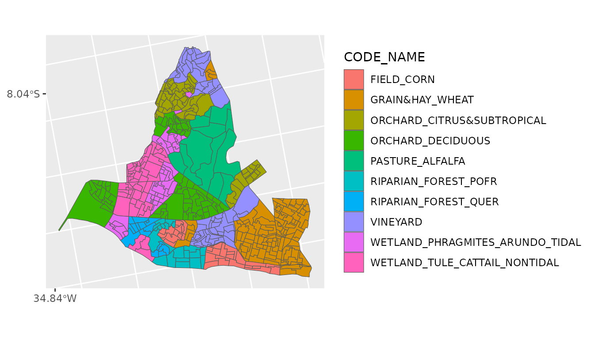
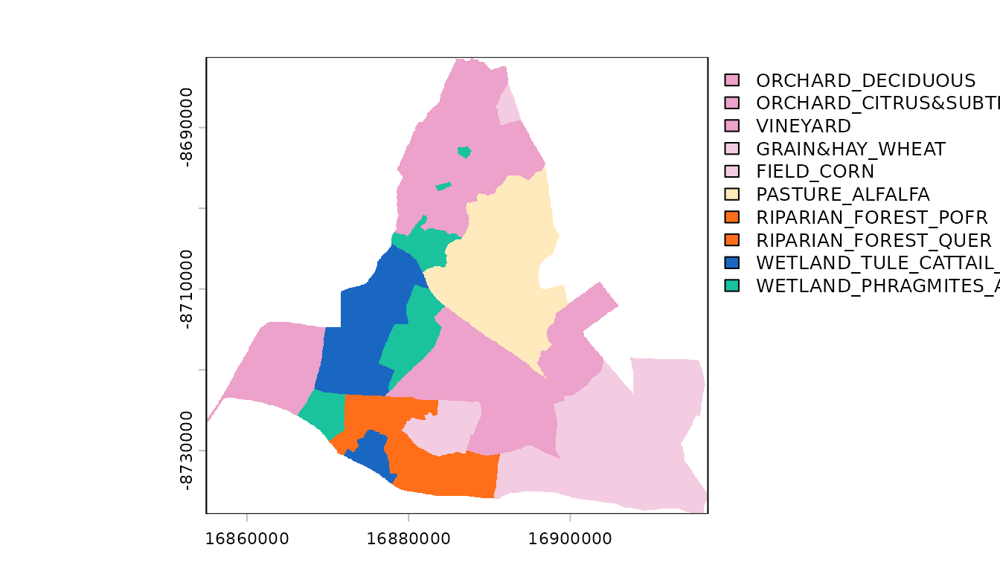
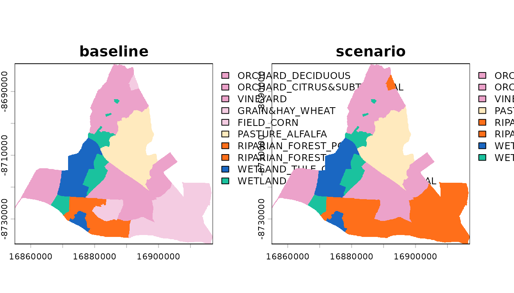

# DeltaMultipleBenefits

## Introduction

The DeltaMultipleBenefits package provides tools for estimating the net
impacts of landscape changes in the Sacramento-San Joaquin River Delta
on multiple metrics of interest to the Delta community. It provides
models and data to support estimating the magnitude of potential
multiple benefits and trade-offs resulting from changes to a baseline
landscape. It can be used to estimate the effects of a proposed change
to the landscape (e.g., habitat restoration plans) or anticipated
changes to the landscape (e.g., agricultural crop conversion trends),
individually or in combination with each other. It can be used to
investigate the complex interactions among multiple drivers of landscape
change and to facilitate discussions about alternative scenarios under
consideration.

The metrics currently supported by this package are grouped into several
categories of potential benefits: Agricultural Livelihoods, Water
Quality, Climate Change Resilience, and Biodiversity Support. Each
category is represented by multiple individual metrics that can be
summarized over the entire landscape, regions within the landscape, or
individual project areas. By comparing metrics estimated from proposed
scenarios of landscape change to metrics estimated for a baseline
landscape representing current conditions, the expected net change in
each metric can be estimated.



Importantly, this package is not designed to find an “optimal” solution
to maximize benefits and minimize trade-offs, but rather to evaluate and
compare realistic proposed alternatives or anticipated future changes.
This is because the list of supported metrics is incomplete compared to
the many interests, values, and goals held by the Delta community, land
managers, organizations, and agencies, so that any optimized solution
would be incomplete and potentially misleading. Instead, this package
requires users to supply spatial data representing their baseline
(current) landscape and alternative scenarios under consideration.
Example baseline and scenario landscapes used in the development of this
package are publicly available for reuse or modification (see
[Supporting
Information](https://pointblue.github.io/DeltaMultipleBenefits/articles/articles/supporting_information.md)).

This vignette serves as a tutorial outlining the major steps of
analyzing alternative landscapes and comparing them to each other,
including:

1.  Preparing new landscape scenarios for analysis
2.  Summarizing the net change in the total area of each land cover
    class
3.  Estimating the net change in simple metrics  
4.  Estimating the net change in metrics informed by spatial models

``` r

library(DeltaMultipleBenefits)
# library(sf)
# library(terra)
# library(dplyr)
# library(tidyr)
# library(ggplot2)
# library(tibble)
```

## Step 1. Preparing a new landscape scenario for analysis

To prepare a new landscape scenario for analysis with the
*DeltaMultipleBenefits* framework, its land cover classifications must
first be aligned with those used in the framework, which are designed to
work with the existing metrics and species distribution models. This
land cover classification scheme includes both natural and agricultural
land cover classes, and is organized hierarchically into major land
cover classes and subclasses. Following Phase 2 of developing this
package, we substantially updated the vegetation key to accommodate many
more wetland vegetation suclasses.

``` r

data(key, package = 'DeltaMultipleBenefits')
head(key)
#> # A tibble: 6 × 7
#>   CODE_NUM CODE_NAME                  CLASS          SUBCLASS DETAIL LABEL COLOR
#>      <dbl> <chr>                      <chr>          <chr>    <chr>  <chr> <chr>
#> 1       10 AG_PERENNIAL               PERENNIAL CRO… NA       NA     Pere… #ECA…
#> 2       11 ORCHARD_DECIDUOUS          NA             DECIDUO… NA     Orch… #ECA…
#> 3       15 ORCHARD_CITRUS&SUBTROPICAL NA             CITRUS … NA     Orch… #ECA…
#> 4       19 VINEYARD                   NA             VINEYARD NA     Vine… #ECA…
#> 5       20 AG_ANNUAL                  ANNUAL CROPS   NA       NA     Annu… #F4C…
#> 6       21 GRAIN&HAY                  NA             GRAIN &… NA     Grai… #F4C…
```

We generally recommend assigning all land covers in your landscape
scenario to the most specific subclass in the existing scheme as
possible. Certain metrics and species distribution models will use
individual subclasses, while others will lump them together into broader
groupings.

### 1.1 Working with polygons

The most recent, comprehensive land cover and land use data set for the
Delta and Suisun Marsh that we are aware of is the
“Habitat_types_modern” provided in SFEI’s Landscape Scenario Planning
Tool v.3.0.0. To support alignment with this data set and its land cover
classification scheme, we developed the
[`classify_landcover.sf()`](https://pointblue.github.io/DeltaMultipleBenefits/reference/classify_landcover.sf.md)
function to support cross-walking that layer to the land cover classes
and subclasses required by the models and metrics in this package. The
result of this function is the additon of fields representing the most
detailed land cover class or subclass that can be assigned according to
the scheme provided in `key`, as well as the corresponding predictors
required to fit the species distribution models supported by this
package.

``` r

# EXAMPLE NOT RUN:
lspt <- sf::read_sf('path/to/Habitat_types_modern.shp')
lc_classified <- classify_landcover.sf(lspt)
```

Alternatively, and to work with other land cover data sources, manually
align land cover classes and subclasses with those provided in `key`. As
a toy example, and for further demonstrating the additional steps in
this vignette, we’ll work with the `olinda1` dataset provided with the
`sf` package. This data set includes place names instead of land cover
classifications, but we’ll treat them as though they represented land
covers and recode them to supported `CODE_NAME` values in the `key`.
Finally, we’ll join the `key` data to match new `CODE_NAME` values to
`CODE_BASELINE` values we’ll need later on.

``` r

olinda1 <- sf::st_read(system.file("shape/olinda1.shp", package = "sf"), 
                       quiet = TRUE) |> 
  sf::st_transform(26910)
head(olinda1)
#> Simple feature collection with 6 features and 6 fields
#> Geometry type: POLYGON
#> Dimension:     XY
#> Bounding box:  xmin: 16885570 ymin: -8723971 xmax: 16892730 ymax: -8717533
#> Projected CRS: NAD83 / UTM zone 10N
#>      ID      CD_GEOCODI   TIPO   CD_GEOCODB    NM_BAIR V014
#> 1 28801 260960005000001 URBANO 260960005020 Ouro Preto 1119
#> 2 28802 260960005000002 URBANO 260960005020 Ouro Preto 1267
#> 3 28803 260960005000003 URBANO 260960005020 Ouro Preto  557
#> 4 28804 260960005000004 URBANO 260960005020 Ouro Preto  709
#> 5 28805 260960005000005 URBANO 260960005020 Ouro Preto 1045
#> 6 28806 260960005000006 URBANO 260960005020 Ouro Preto  727
#>                         geometry
#> 1 POLYGON ((16889505 -8717533...
#> 2 POLYGON ((16891561 -8719078...
#> 3 POLYGON ((16890240 -8721218...
#> 4 POLYGON ((16888737 -8722217...
#> 5 POLYGON ((16886823 -8722100...
#> 6 POLYGON ((16887682 -8720990...

new_shp <- olinda1 |> 
  # recode existing place name values with supported land cover names in key
  dplyr::mutate(
    CODE_NAME = dplyr::case_when(
      NM_BAIR %in% c('Ouro Preto', 'Sítio Novo', 'Sapucaia', 'Salgadinho') ~
        'ORCHARD_DECIDUOUS',
      NM_BAIR %in% c('Tabajara', "Caixa D'Água", 'Águas Compridas', 
                     'São Benedito') ~ 
        'ORCHARD_CITRUS&SUBTROPICAL',
      NM_BAIR %in% c('Fragoso', 'Alto da Bondade', 'Alto da Conquista', 
                     'Passarinho') ~ 
        'VINEYARD',
      NM_BAIR %in% c('Bultrins', 'Jardim Atlântico', 'Rio Doce', 
                     'Alto do Sol Nascente') ~ 
        'GRAIN&HAY_WHEAT',
      NM_BAIR %in% c('Alto da Nação', 'Monte', 'Casa Caiada') ~ 
        'FIELD_CORN',
      NM_BAIR %in% c('Guadalupe', 'Bonsucesso', 'Bairro Novo') ~ 
        'RIPARIAN_FOREST_POFR',
      NM_BAIR %in% c('Varadouro', 'Amparo', 'Amaro Branco') ~ 
        'RIPARIAN_FOREST_QUER',
      NM_BAIR %in% c('Vila Popular', 'Peixinhos', 'Carmo') ~
        'WETLAND_TULE_CATTAIL_NONTIDAL',
      NM_BAIR %in% c('Jardim Brasil', 'Aguazinha', 'Santa Teresa') ~ 
        'WETLAND_PHRAGMITES_ARUNDO_TIDAL',
      is.na(NM_BAIR) ~ 'PASTURE_ALFALFA',
      TRUE ~ 'UNKNOWN')) |> 
  # transfer CODE_BASELINE values from key
  dplyr::left_join(key |> dplyr::select(CODE_NUM, CODE_NAME, COLOR), by = 'CODE_NAME') 

ggplot2::ggplot(new_shp) + 
  ggplot2::geom_sf(ggplot2::aes(fill = CODE_NAME))
```

 Next,
convert the polygons to a raster format with the desired projection,
extent, and resolution. We’ll first create a raster template from the
polygon layer with a small number of columns and rows (and thus coarse
resolution) just for demonstration purposes. However, to ensure
alignment with other rasters in your analysis, it usually works best to
use an existing raster as a template. Next, transfer the land cover code
values to the template to create a new landscape raster that we’ll treat
as our “baseline” landscape. Finally, to help with plotting, we’ll
assign labels and default color codings to each value.

``` r


template = terra::rast(ncols = 1000, nrows = 1000, 
                       extent = sf::st_bbox(new_shp))
terra::crs(template) = 'epsg:26910'
baseline = terra::rasterize(x = new_shp, y = template, field = 'CODE_NUM')
names(baseline) = 'baseline'

# assign factor levels:
levels(baseline) <-  key |> 
  dplyr::select(CODE_NUM, CODE_NAME) |> as.data.frame()

# assign color coding
terra::coltab(baseline) <- key |> 
  dplyr::select(CODE_NUM, COLOR) |> as.data.frame()
terra::plot(baseline)
```



### 1.2 Working with existing rasters

If the landscape to be analyzed is in a raster format already, the
existing land cover values encoded should be similarly translated to the
supported values in the existing land cover classification scheme. As an
example, we’ll use `baseline` raster we created above, and create a new
version from it to serve as our new `scenario` of landscape change.

``` r

# basic example habitat restoration scenario: all wheat (22) and corn (26) 
# pixels are converted to Fremont cottonwood riparian forest (71)
scenario <- terra::classify(
  baseline, 
  rcl = data.frame(from = c(22, 26), 
                   to = c(71, 71)) |> as.matrix())
levels(scenario) <- key |> 
  dplyr::select(CODE_NUM, CODE_NAME) |> as.data.frame()
terra::coltab(scenario) <- key |> 
  dplyr::select(CODE_NUM, COLOR) |> as.data.frame()

# stack landscapes to compare
landscapes = c(baseline, scenario)
names(landscapes) = c('baseline', 'scenario')
terra::plot(landscapes) 
```



``` r

# Note the light pink wheat and corn cells have changed to orange-red riparian 
# cells
rm(baseline, scenario, olinda1, key)
```

## Step 2. Summarizing the net change in the total area of each land cover class

Built-in functions make it simple to estimate the change in the total
area of each land cover class between the baseline and one or more
scenario landscape rasters. First, sum the total area of each land cover
class in each landscape raster, then summarize the change between them.

**sum_landcover:** This function takes a SpatRaster with one or more
layers and, for each layer, counts the number of pixels of each unique
land cover class and multiplies by the provided `pixel_area` value to
estimate the total area of each land cover class. It returns a tibble
with the scenario name (taken from the names of each raster layer), the
`CODE_NAME` of each land cover class, and the total area. Here we’ll
first use
[`terra::cellSize`](https://rspatial.github.io/terra/reference/cellSize.html)
to estimate the area of each pixel in ha. The option `rollup = TRUE`
adds extra rows to the output with the sum total area for all riparian
and wetland subclasses. This function also supports options to mask out
portions of the raster and/or to summarize the total area by zones or
regions within the landscape.

``` r

units = 'ha'

area = terra::cellSize(landscapes, unit = units)[50,50] |> tibble::deframe()

landcover_totals = sum_landcover(
  landscapes = landscapes, 
  pixel_area = area,
  rollup = TRUE,
  zones = NULL) |>
  dplyr::arrange(scenario, CODE_NAME) |> 
  dplyr::mutate(units = units)
head(landcover_totals)
```

**sum_change:** This function calculates the net change in the area of
each land cover class between the baseline landscape and one or more
scenario landscapes. Note that this function expects the output from
`sum_landcover`, which includes the field `scenario` representing the
names of each landscape. At least one scenario must be named “baseline”,
and all other scenarios will be assumed to represent an alternative
scenario landscape for comparison to the baseline. Thus the net change
for multiple scenarios can be estimated simultaneously. The result is a
tibble with the scenario name, the `CODE_NAME` of each land cover class,
fields representing the total area of the land cover class for the
scenario in question and the corresponding area for the baseline, and
then the `net_change` between them, where a positive value indicates an
increase from the baseline.

``` r

landcover_change = sum_change(landcover_totals)
head(landcover_change)
# Note net increase in riparian (and specifically POFR) and decrease in wheat and corn, as expected.
```

## Step 3. Estimating the net change in simple metrics

The `DeltaMultipleBenefits` package supports evaluation of several
relatively “simple” metrics representing the benefits categories:
*agricultural livelihoods*, *water quality*, and *climate change
resilience*. For example, agricultural livelihood metrics include the
number of agricultural jobs, their average annual wage, and gross
production value. These are all “simple” metrics in the sense that a
single mean value for each metric is used to represent each land cover
class, regardless of where in the Delta the land cover is located.
Therefore, estimating the net change in these metrics between a baseline
and scenario landscape is relatively simple compared to estimating the
net change in metrics derived from a spatial model (see below). The
steps for estimating the net change in these simple metrics are similar
to estimating the net change in land cover area above. However, the
uncertainty in the value of each metric for each land cover class (where
available) is also accounted for in estimating the uncertainty in the
net change.

The values assigned to each land cover class for each metric are
included in this package, and are also published and available to
download separately (see [Supporting
Information](https://pointblue.github.io/DeltaMultipleBenefits/articles/articles/supporting_information.md)).
However, these metrics can be edited to provide updated values or custom
additional metrics as needed.

``` r

data(metrics, package = 'DeltaMultipleBenefits')
head(metrics)
```

**sum_metrics:** First estimate the total landscape score for each
metric and landscape raster, by combining total area of each land cover
class estimated above with the per-unit-area metrics for each land cover
class. For most metrics, this involves multiplying the per-unit-area
metrics by the total area of each land cover class and summing over the
entire landscape. For Annual Wages (as part of the Agricultural
Livelihoods category of benefits), it instead calculates the new
weighted average wage across all agricultural hectares (i.e., those
supporting agricultural jobs with an associated wage value). For metrics
in the Climate Change Resilience category, it instead calculates the new
overall average resilience score on a scale of 1 (low resilience) to 10
(high resilience). The function returns a tibble with the scenario name,
fields from `metrics` defining metric categories and units, a
`SCORE_TOTAL` and a `SCORE_TOTAL_SE`, representing the combined
uncertainty. The `units` field is also updated to reflect that the
scores are no longer per-hectare, but instead summed over all hectares
in the landscape.

The total area of each land cover class as calculated above includes
both the area of individual riparian and managed wetland subclasses as
well as the roll-up total area (because we used `rollup = TRUE`), so we
must take care not to double-count them in the total landscape scores
calcualted here. Thus far, these simple `metrics` are not specific to
individual riparian and wetland subclasses and instead apply to riparian
and wetland land covers generally. Therefore, here we filter out the
subclasses to exclude them from this calculation.

*Note: We will get a warning message here, because our toy example
landscape does not include all land cover classes present in our metrics
data.*

``` r

scores = sum_metrics(
  metricdat = metrics,
  areadat = landcover_totals |> dplyr::filter(!(grepl('RIPARIAN_|WETLAND_', CODE_NAME)))) 
head(scores)
```

**sum_change:** Then, we can again use `sum_change` to estimate the
difference in each metric between the baseline and scenario landscapes.
However, this time because there is uncertainty in the total landscape
scores, the uncertainty in the difference will also be estimated. Here
we use a coverage factor `k = 2` to approximate a 95% confidence
interval for the `net_change`.

``` r

scores_change = sum_change(scores, k = 2)
head(scores_change)
```

Visualize the resulting estimates of net change: (Note no error bar for
N loading due to lack of uncertainty estimates)

``` r

scores_change |> 
  dplyr::mutate(
    # invert water quality scores so a reduction in pesticide use is shown as a 
    # net benefit
    net_change = dplyr::if_else(
      METRIC_CATEGORY == 'Water Quality', -1 * net_change, net_change),
    # rescale scores and confidence intervals with very large numbers to facilitate
    # comparisons
    dplyr::across(
      c(net_change, lcl, ucl), 
      ~dplyr::case_when(
             METRIC == 'Gross Production Value' ~ .x/1000,
             METRIC == 'N loading' ~ .x/1000,
             TRUE ~ .x))
    ) |> 
  ggplot2::ggplot(ggplot2::aes(net_change, METRIC)) +
  ggplot2::facet_wrap(~METRIC_CATEGORY, ncol = 1, scales = 'free') +
  ggplot2::geom_col(fill = 'gray80') + 
  ggplot2::geom_errorbar(ggplot2::aes(xmin = lcl, xmax = ucl), width = 0.25) +
  # add blank geoms to ensure zeroes line up across facets
  ggplot2::geom_blank(ggplot2::aes(x = -ucl)) + 
  ggplot2::geom_blank(ggplot2::aes(x = -lcl)) +
  ggplot2::theme_minimal()
```

## Step 4. Estimating the net change in metrics informed by spatial models

In addition to the “simple” metrics described above, the
`DeltaMultipleBenefits` package supports evaluation of more complex
spatial models that consider not only the total extent of each land
cover class in the landscape but also their spatial configuration. For
example, whether or not an area is suitable habitat for wildlife species
often depends on both the local land cover class as well as the
surrounding land cover classes and proximity to specific features on the
landscape (such as distance to a water channel). Evaluating the net
change in these metrics between scenario and baseline landscapes is
necessarily more complicated than evaluating the “simple” metrics above,
but also allows for more nuance and spatial variation within the
landscape.

The package currently supports application of several species
distribution models for birds to represent the *Biodiversity Support*
benefits category, with metrics that represent the estimated extent of
suitable habitat for each species or group of species. These include 3
sets of models: \* “riparian”: 9 riparian landbird species during the
breeding season \* “waterbird_fall”: 6 groups of waterbird species
during the fall season \* “waterbird_win”: 6 groups of waterbird species
during the winter season \* “tima”: 7 tidal marsh bird species,
including 3 secretive marsh bird species and 4 tidal wetland songbird
species

See [Supporting
Information](https://pointblue.github.io/DeltaMultipleBenefits/articles/articles/supporting_information.md)
for links to manuscripts and reports describing the development of these
models and links to download the R data files containing these models
(they are not provided within the R package due to their size).

Spatial models for other species, other benefits categories and metrics,
and/or to represent the “simple” metrics in a more nuanced,
spatially-dependent way could be incorporated in future versions of this
package. Please contact us to suggest future extensions of this package
and to collaborate on further development.

All of these species distribution models include predictors representing
local land cover statistics (e.g., proportion cover within 100m) and
predictors representing the surrounding landscape (e.g., proportion
cover within 2km). However, the land cover classes and subclasses most
relevant to each group of species vary, while other land cover classes
may be lumped together into a single predictor. Therefore, to apply
these species distribution models to new baseline and scenario
landscapes, the land cover classes must be first cross-walked to the
relevant predictors for each set of models. Then, focal statistics must
be run using the moving window sizes relevant to each set of models.
Finally, additional predictors specific to individual sets of models may
also need updating. Here, we walk through the key steps necessary for
each set of models.

### 4.1 Tidal marsh bird models (“tima”)

The models developed in Phase 2 include 7 tidal wetland focal species: 3
secretive marsh bird species (California Black Rail, American Bittern,
and Least Bittern), as well as 4 tidal marsh songbird species (Common
Yellowthroat, Marsh Wren, Song Sparrow, and Yellow-breasted Chat).

#### 4.1.1 Prepare landscape predictors

To apply the “tima” models to new baseline and scenario landscapes,
first use built-in functions to prepare the landscape rasters.

**python_focal_prep:** The first step is to prepare the landscape
rasters for calculating focal stats by reclassifying them to match the
predictor groupings required by the “tima” models and separating them
into layers representing each distinct predictor, with a default value
of `1` everywhere the land cover class is present, and a `0` otherwise.
The result can be optionally directly written to a directory located at:
`dir/SDM/landscape_name` where `landscape_name` is taken from the
name(s) of the input SpatRaster. If the directory does not already
exist, it will be created automatically.

**estimate_tima_patchsize:** From the results, we’ll also estimate the
size of contiguous patches of tidal wetland vegetation.

*Note: We will get warning messages here, because our toy example
landscape does not include all land cover classes required to fit the
“tima” models.*

``` r


predictors_tima = python_focal_prep(landscapes, SDM = 'tima', dir = 'example',
                                    fill = FALSE) |> suppressWarnings()

psize = estimate_tima_patchsize(predictors_tima, dir = 'example')

terra::plot(c(predictors_tima$baseline$TWET, psize[[1]]))
```

**rasterize_stream_channels:** To facilitate estimating the density
(proportion cover) of channel lines, we also need to compile water
channel data, based on the California Aquatic Resources Inventory (CARI)
Streams (lines) data set. These data are freely available for download
from
[SFEI](https://www.sfei.org/data/california-aquatic-resource-inventory-cari-gis-data)
and
[CDFW](https://filelib.wildlife.ca.gov/Public/BDB/GIS/BIOS/metadata/DS2836.html).
Download these data first, and then either provide the path to the
shapefile or file geodatabase, or provide the `sf` object directly. By
default, this layer will be considered the “baseline” representation of
stream channels. However, it can also be applied to alternative
scenarios if stream channel locations will not change by giving a
different `landscape_name`, or the result of this function can be
manipulated to represent changes to channel locations under alternative
scenarios.

``` r

chan = rasterize_stream_channels(
  x = 'path/to/cari_streams', template = predictors_tima$baseline, 
  min_length = 1, dir = 'example',
  landscape_name = 'baseline')
```

**python_focal_stats:** The next step is to generate focal statistics
for each of the separate rasters generated in the previous steps that
represent land cover predictors, tidal wetland patch size, and stream
channel locations. Focal statistics perform a given operation on all
cells within a given distance of the focal cell, and repeated for every
cell in the raster.

For the “tima” models, this function will calculate the mean value for
the presence of every raster layer in `pathin/SDM/landscape_name` within
moving windows on each of two spatial scales (50m and 2km). The function
must be run a second time to with `regex = 'PSIZE.tif'` and
`overwrite = TRUE` to replace the mean value of the tidal marsh patch
size within each spatial scale with the maximum value. All results are
written directly to `dir/SDM/landscape_name` and not returned to working
memory.

These calculations can be very slow, depending on the size and
resolution of the rasters. To enhance processing speed, this function
currently requires Python to be installed on your system and
specifically `arcpy` with the Spatial Analyst extension. The first time
this function is run in each session, internal helper functions will
check that `arcpy` is installed and try to load it, but to ensure the
correct version of Python can be found, you may need to specify the
correct filepath.

``` r

python_focal_stats(SDM = 'tima', 
                   landscape_names = c('baseline', 'scenario'),
                   pathin = 'example',
                   dir = 'SDM_predictors')

python_focal_stats(SDM = 'tima', 
                   landscape_names = c('baseline', 'scenario'),
                   pathin = 'example',
                   dir = 'SDM_predictors',
                   regex = 'PSIZE.tif',
                   overwrite = TRUE)
```

**update_covertype:** Finally, covertype is a categorical predictor
reflecting the land cover class in each pixel. The original bird survey
data used to develop these models only included a subset of available
land cover classes, and these classes had an influence on the
probability of species presence: wetland, riparian, water, and a
combined group of annual agricultural crops, idle fields, grassland, and
ruderal (non-woody) vegetation. This function extracts these landcovers
from the input SpatRasters and creates a “LANDCOVER.tif” layer ready to
use in the distribution models. It can be written to the same output
directory as the results from running
[`python_focal_stats()`](https://pointblue.github.io/DeltaMultipleBenefits/reference/python_focal_stats.md)
above.

``` r

covertype_tima = update_covertype(landscapes, SDM = "tima", dir = 'SDM_predictors')
terra::plot(covertype_tima)
```

#### 4.1.2 Generate model predictions

**fit_SDM:** Use the predictors created in the previous step for each
landscape to fit the distribution models for each of the 7 “tima”
species. The `modlist` should refer to an R object containing a list of
the tidal marsh distribution models. See [Supporting
Information](https://pointblue.github.io/DeltaMultipleBenefits/articles/articles/supporting_information.md)
to download these models. The levels of the categorical predictor
`LANDCOVER` must be specified in the call to `fit_SDM`, and in the
correct order.

Open water was considered to be an unsuitable land cover class *a
priori*, and so we can specify `unsuitable = 90` (the land cover class
value for open water); this will create a mask from the provided
`landscape` with 0 values wherever the land cover class equals the
values provided in `unsuitable` and NA elsewhere, used to cover the
predicted values from the model. Alternatively, the predictors can all
be masked by an open water layer before running
[`fit_SDM()`](https://pointblue.github.io/DeltaMultipleBenefits/reference/fit_SDM.md).

``` r

fit_SDM(pathin = 'SDM_predictors', 
        SDM = 'tima',
        landscape_name = 'baseline',
        modlist = BRT_tidal_wetlands,
        factors = list(list('LANDCOVER' = c('WETLAND', 'RIPARIAN', 'WATER', 'AGGRPAS'))),
        type = 'response',
        unsuitable = 90,
        dir = 'SDM_results')

fit_SDM(pathin = 'SDM_predictors', 
        SDM = 'tima',
        landscape_name = 'scenario',
        modlist = BRT_tidal_wetlands,
        factors = list(list('LANDCOVER' = c('WETLAND', 'RIPARIAN', 'WATER', 'AGGRPAS'))),
        type = 'response',
        unsuitable = 90,
        dir = 'SDM_results')
```

*Note: The models will not run if all required predictors are not
provided.* The toy example landscape data provided here does not include
all required predictors.

**transform_SDM:** The model-predicted results can be converted into
binary presence-absence predictions using threshold statistics derived
from the
[`dismo::threshold`](https://rdrr.io/pkg/dismo/man/threshold.html)
function. Here, we use the statistic `equal_sens_spec`, which is the
value at which specificity (the probability of correctly predicting
species absence) is equal to sensitivity (the probability of correctly
predicting species presence), but other statistics can be selected (see
[`?dismo::threshold`](https://rdrr.io/pkg/dismo/man/threshold.html)).

``` r

transform_SDM(pathin = 'SDM_results',
              SDM = 'tima', landscape_name = 'baseline',
              modlist = BRT_tidal_wetlands,
              stat = 'equal_sens_spec',
              dir = 'SDM_results_threshold')

transform_SDM(pathin = 'SDM_results',
              SDM = 'tima', landscape_name = 'scenario',
              modlist = BRT_tidal_wetlands,
              stat = 'equal_sens_spec',
              dir = 'SDM_results_threshold')
```

### 4.2 Riparian landbird models (“riparian”)

The models developed in Phase 1 include 9 riparian landbird species,
including 3 of the same species also addressed in Phase 2 for tidal
wetlands: Common Yellowthroat, Marsh Wren, Song Sparrow, and
Yellow-breasted Chat, as well as: Nuttall’s Woodpecker, Ash-throated
Flycatcher, Black-headed Grosbeak, Lazuli Bunting, Yellow Warbler, and
Spotted Towhee. These models were built for the entire Central Valley
and focused on riparian vegetation and did not include as much wetland
vegetation detail as the Phase 2 models. Thus, we now recommend using
the Phase 2 models for those species, and Phase 1 models for the rest.

#### 4.2.1 Prepare landscape predictors

To apply the “riparian” models to new baseline and scenario landscapes,
the process is very similar to that for “tima” demonstrated above, with
a few exceptions.

**classify_landcover & python_focal_prep:** The first step is again to
prepare for focal statistics, including by creating the predictor
groupings required by the “riparian” models. In this case, it is best to
work directly with the original LSPT Habitat_types_modern layer, if
possible. The
[`classify_landcover.sf()`](https://pointblue.github.io/DeltaMultipleBenefits/reference/classify_landcover.sf.md)
function applied to the LSPT data will return the corresponding
predictors for the “riparian” models with the greatest accuracy and
specificity. Then the call to
[`python_focal_prep()`](https://pointblue.github.io/DeltaMultipleBenefits/reference/python_focal_prep.md)
can include `classified = TRUE` to bypass the internal call to
[`classify_landcover.SpatRaster()`](https://pointblue.github.io/DeltaMultipleBenefits/reference/classify_landcover.SpatRaster.md).
To demonstrate:

``` r

lspt <- sf::read_sf('path/to/Habitat_types_modern.shp')
lc_classified <- classify_landcover.sf(lspt)
baseline_rip = terra::rasterize(x = lc_classified, y = template, 
                                field = 'PREDICTOR_RIPARIAN')
scenario_rip <- terra::classify(
  baseline_rip, 
  rcl = data.frame(from = c(22, 26), 
                   to = c(71, 71)) |> as.matrix())
landscapes_rip = c(baseline_rip, scenario_rip)
names(landscapes_rip) = c('baseline', 'scenario')

predictors_rip = python_focal_prep(landscapes, SDM = 'riparian', dir = 'example',
                                   fill = FALSE, classified = TRUE) |> suppressWarnings()
```

Otherwise,
[`python_focal_prep()`](https://pointblue.github.io/DeltaMultipleBenefits/reference/python_focal_prep.md)
can still be called directly (with `classified = FALSE`), but the
internal call to
[`classify_landcover.SpatRaster()`](https://pointblue.github.io/DeltaMultipleBenefits/reference/classify_landcover.SpatRaster.md)may
produce some minor differences from the original land cover
classification scheme used in the development of these models. Note that
these layers can be written to the same `dir` as the ‘tima’ models
above, but they will be kept in a separate subdirectory for the
‘riparian’ SDMs.

``` r


predictors_rip = python_focal_prep(landscapes, SDM = 'riparian', dir = 'example',
                                   fill = FALSE) |> suppressWarnings()

terra::plot(predictors_rip$baseline)
```

**python_focal_stats:** As above, the next step is to generate focal
statistics for each of the separate land cover rasters.

``` r

python_focal_stats(SDM = 'riparian', 
                   landscape_names = c('baseline', 'scenario'),
                   pathin = 'example',
                   dir = 'SDM_predictors')
```

#### 4.2.2 Prepare additional predictors

The “riparian” models also include several predictors not based on land
cover data: - `area.ha`, accounting for variation in survey effort,
which should be held constant for new predictions; - `region`,
indicating whether the survey was conducted in the Sacramento Valley
(region = 0) or in the Delta or San Joaquin (region = 1) - `bio_1`,
representing annual mean temperature, 1970-2000 - `bio_12`, representing
total annual precipitation, 1970-2000 - `streamdist`, representing the
square-root of the distance (in m) to the nearest stream or river, based
on the National Hydrography Dataset

To represent `area.ha` in new predictions, we recommend using a constant
value of 3.14159, referring to the total area (in hectares) within 50m
of a bird survey location, after 4 surveys. For `region`, we recommend
using a constant value of 1 for predictions in the Delta. These constant
values can be called directly in the
[`fit_SDM()`](https://pointblue.github.io/DeltaMultipleBenefits/reference/fit_SDM.md)
function below.

For `bio_1`, `bio_12`, and `streamdist`, see [Supporting
Information](https://pointblue.github.io/DeltaMultipleBenefits/articles/articles/supporting_information.md)
to download the original layers used in developing these models. They
can be added directly to the same directory containing the land cover
predictors for use in fitting the SDMs, though they may need to be
cropped and aligned with the other rasters first.

#### 4.2.3 Generate model predictions

**fit_SDM:** Once all required predictors are represented, the next step
is to fit the distribution models for each of the 9 “riparian” species.
Alternatively, only include the 6 species not already represented by the
“tima” models. As above, see [Supporting
Information](https://pointblue.github.io/DeltaMultipleBenefits/articles/articles/supporting_information.md)
to download these models. Note that, in the original analysis open water
was considered to be an unsuitable land cover class for riparian
landbirds *a priori*, and so we can specify `unsuitable = 90` (the land
cover class value for open water); this will create a mask from the
provided `landscape` with 0 values wherever the land cover class equals
the values provided in `unsuitable` and NA elsewhere, used to cover the
predicted values from the model.

**transform_SDM:** Finally, as above, the model-predicted results can be
converted into binary presence-absence predictions using threshold
statistics.

``` r

# baseline landscape:
fit_SDM(pathin = 'SDM_predictors', 
        SDM = 'riparian',
        landscape_name = 'baseline',
        modlist = BRT_riparian_wetlands[[c('NUWO', 'ATFL', 'BHGR', 'LAZB', 'SPTO', 'YEWA')]],
        constants = data.frame(region = 1,
                               area.ha = 3.141593),
        unsuitable = 90, #open water
        dir = 'SDM_results')

transform_SDM(pathin = 'SDM_results',
              SDM = 'riparian', landscape_name = 'baseline',
              modlist = BRT_riparian_wetlands[[c('NUWO', 'ATFL', 'BHGR', 'LAZB', 'SPTO', 'YEWA')]],
              stat = 'equal_sens_spec',
              dir = 'SDM_results_threshold')

# scenario landscape:
fit_SDM(pathin = 'SDM_predictors', 
        SDM = 'riparian',
        landscape_name = 'scenario',
        modlist = BRT_riparian_wetlands[[c('NUWO', 'ATFL', 'BHGR', 'LAZB', 'SPTO', 'YEWA')]],
        constants = data.frame(region = 1,
                               area.ha = 3.141593),
        unsuitable = 90, #open water
        dir = 'SDM_results')

transform_SDM(pathin = 'SDM_results',
              SDM = 'tima', landscape_name = 'scenario',
              modlist = BRT_riparian_wetlands[[c('NUWO', 'ATFL', 'BHGR', 'LAZB', 'SPTO', 'YEWA')]],
              stat = 'equal_sens_spec',
              dir = 'SDM_results_threshold')
```

### 4.3 Waterbird models (“waterbird_fall” and “waterbird_win”)

The models developed in Phase 1 also include 5 groups of waterbird
species during the fall season (July - mid-Nov) and 6 groups during the
winter (mid-Nov - Mar): geese, dabbling ducks, diving ducks (winter
only), cranes, shorebirds, and herons/egrets. The two seasons represent
the changes in species abundance during the non-breeding season as well
as changes in land cover, especially specific crop classes in areas
where there is a distinct winter crop. Therefore, fitting these models
requires season-specific baseline and scenario landscapes.

#### 4.3.1 Prepare landscape predictors

**update_pwater:** To apply the “waterbird_fall” and “waterbird_win”
models to new baseline and scenario landscapes, first handle changes in
the probability of surface water. The waterbird distribution models
included `pwater`, a predictor indicating the probability of surface
water during each season. It was included both as a direct predictor
(i.e. at each pixel or survey location) and as the proportion of each
land cover class surrounding each pixel or survey location that was
flooded, This function is used to create estimates of pwater for
portions of the alternative scenario landscapes that have changed land
cover class, and therefore may have changed in the probability of
surface water. The new predicted value for `pwater` assigned to these
areas is based on rasters representing baseline land cover classes and
corresponding baseline historical flooding averages during the relevant
season to calculate the average historical flooding probability by land
cover class. See [Supporting
Information](https://pointblue.github.io/DeltaMultipleBenefits/articles/articles/supporting_information.md)
to download the original historical flooding data used in developing
these models; substantial changes in land cover or flooding patterns may
require updating to more current flooding data. Here, for illustration
purposes, we randomly generate an example baseline `pwater` for each
season and then use the function to create an updated `pwater` layer for
our example scenario.

``` r

pwater_base_fall = terra::rast(
  landscapes$baseline,
  vals = runif(terra::ncell(landscapes$baseline), min = 0, max = 1))
pwater_scenario_fall = update_pwater(
  waterdat = pwater_base_fall, SDM = 'waterbird_fall',
  landscape_name = 'scenario',
  mask = landscapes$baseline,
  dir_focal = 'example', dir_final = 'SDM_predictors', 
  baseline_landscape = landscapes$baseline, 
  scenario_landscape = landscapes$scenario,
  floor = FALSE,
  overwrite = TRUE)
pwater_fall = c(pwater_base_fall, pwater_scenario_fall)
names(pwater_fall) = c('baseline', 'scenario')

# repeat for winter
pwater_base_win = terra::rast(
  landscapes$baseline,
  vals = runif(terra::ncell(landscapes$baseline), min = 0, max = 1))
pwater_scenario_win = update_pwater(
  waterdat = pwater_base_win, SDM = 'waterbird_win',
  landscape_name = 'scenario',
  mask = landscapes$baseline,
  dir_focal = 'example', dir_final = 'SDM_predictors', 
  baseline_landscape = landscapes$baseline, 
  scenario_landscape = landscapes$scenario,
  floor = FALSE,
  overwrite = TRUE)
pwater_win = c(pwater_base_win, pwater_scenario_win)
names(pwater_win) = c('baseline', 'scenario')
```

**python_focal_prep:** Now use built-in functions to prepare the
remaining landscape rasters, as above, this time incorporating the
updated `pwater` estimates. By providing a `pixel_value`, cells where
each land cover class is present will be filled with a value
corresponding to the area of each pixel (for use in summing the total
area of each land cover class with focal statistics). In addition, by
providing the `pwater` data as a `subset`, the `pwater` layer will be
masked by each land cover class, resulting in a second set of layers
filled with values corresponding to their probability of being flooded.
Because two layers are created to represent each land cover class, two
custom `suffix` values must be provided to distinguish them when the
files are written to `dir/SDM/landscape_name`.

*Note: If we had changes in crop class between the fall and winter
seasons, we would need to generate a winter version of the `landscapes`
data to analyze.*

``` r


predictors_watfall = python_focal_prep(
  landscapes, SDM = 'waterbird_fall', dir = 'example', fill = FALSE,
  subset = pwater_fall, pixel_value = 0.09, suffix = c('_area', '_pfld')) |> 
  suppressWarnings()

predictors_watwin = python_focal_prep(
  landscapes, SDM = 'waterbird_win', dir = 'example', fill = FALSE,
  subset = pwater_win, pixel_value = 0.09, suffix = c('_area', '_pfld')) |> 
  suppressWarnings()
```

**python_focal_stats:** As above, the next step is to generate focal
statistics for each of the separate land cover rasters.

``` r

python_focal_stats(SDM = 'waterbird_fall', 
                   landscape_names = c('baseline', 'scenario'),
                   pathin = 'example',
                   dir = 'SDM_predictors')

python_focal_stats(SDM = 'waterbird_win', 
                   landscape_names = c('scenario', 'scenario'),
                   pathin = 'example',
                   dir = 'SDM_predictors')
```

#### 4.3.2 Prepare additional predictors

**update_roosts & python_dist:** In addition to changes in the
probability of open water on the landscape, land cover changes may also
affect the suitability of traditional night-time crane roosts. Because
the distance to roost was an important predictor on the distribution
models for cranes, accounting for the loss of traditional roost
locations would affect these distances. The original data source for
traditional roost locations is included in this package, but could be
combined with updated information as it becomes available.

The `update_roosts` function allows defining which land cover class
codes are incompatible with crane roosts, and the threshold proportion
of the traditional crane roost polygon at which the entire roost would
be considered unsuitable. In our original analyses, we considered crane
roosts to be incompatible with perennial crops, urban land cover,
riparian vegetation, woodland, or scrub, and we assumed once 20% of the
roost was covered by unsuitable land covers, the roost location would be
abandoned. The result of `update_roosts` is an intermediate file at
representing the new assumed locations of traditional roosts, which is
then used as an input to `python_dist` for use in updating the estimated
distance to roost predictor for each pixel in the landscape.

*Note: The land cover types we have designated as “unsuitable” for use
as a crane roost are not expected to vary seasonally, and so we do not
need to create separate versions corresponding to fall and winter
waterbird SDMs.*

``` r

data(roosts_original)

update_roosts(
  landscape = landscapes$scenario,
  roosts = terra::vect(roosts_original),
  filename = 'example/roosts/roosts.tif')

droost = python_dist(
  x = roosts,
  scale = 'km',
  dir = 'SDM_predictors',
  SDM = c('waterbird_fall', 'waterbird_win'), # can write to more than one location
  landscape_name = 'scenario',
  filename = 'droost_km.tif')
```

**update_covertype:** Like the “tima” models, these models include a
categorical cover type predictor

``` r

covertype_watfall = update_covertype(landscapes, SDM = "waterbird_fall",
                                     dir = 'SDM_predictors')
terra::plot(covertype_watfall)

covertype_watwin = update_covertype(landscapes, SDM = "waterbird_win", 
                                    dir = 'SDM_predictors')
terra::plot(covertype_watwin)
```

#### 4.3.3 Generate model predictions

**fit_SDM:** Once all required predictors are represented, the next step
is to fit the distribution models for each of the 5 fall waterbird
groups and6 winter waterbird groups. As above, see [Supporting
Information](https://pointblue.github.io/DeltaMultipleBenefits/articles/articles/supporting_information.md)
to download these models. Similar to the “tima” models, the levels of
the categorical predictor `covertype` must be specified in the call to
`fit_SDM`, and in the correct order; note that the factor levels change
between fall and winter seasons. In the original analysis perennial
crops, urban, and barren land covers were considered to be unsuitable
land cover classes *a priori*, and so we can specify
`unsuitable = c(10:19, 60, 130)` (the corresponding land cover class
values).

Also similar to the riparian models, the waterbird models included
`offset`, a predictor accounting for variation in survey effort, with
different values applied to the predictions for waterbird groups in fall
vs. winter, as well as a separate value for cranes and geese during the
fall (which had a more restricted fall season). Thus, due to the
distinct values for `offset`, call `fit_SDM` three times.

**transform_SDM:** Finally, as above, the model-predicted results can be
converted into binary presence-absence predictions using threshold
statistics.

``` r

# fall: cranes, geese
purrr::map(names(landscapes),
           ~fit_SDM(
             pathin = 'SDM_predictors',
             SDM = 'waterbird_fall',
             landscape_name = .x,
             modlist = waterbird_mods_fall[c('crane', 'geese')],
             constants = data.frame(offset = 3.709),
             factors = list(list('covertype' = c('Alfalfa',
                                                 'Irrigated pasture',
                                                 'Rice',
                                                 'Wetland'))),
             unsuitable = c(10:19, 60, 130), 
             landscape = landscapes[[.x]],
             dir = 'SDM_results'))

# fall: dblr, shore, cicon:
purrr::map(names(landscapes),
           ~fit_SDM(
             pathin = 'SDM_predictors',
             SDM = 'waterbird_fall',
             landscape_name = .x,
             modlist = waterbird_mods_fall[c('dblr', 'cicon', 'shore')],
             constants = data.frame(offset = 4.435),
             factors = list(list('covertype' = c('Alfalfa',
                                                 'Irrigated pasture',
                                                 'Rice',
                                                 'Wetland'))),
             unsuitable = c(10:19, 60, 130), 
             landscape = landscapes[[.x]],
             dir = 'SDM_results'))

# winter: all
purrr::map(names(landscapes),
           ~fit_SDM(
             pathin = 'SDM_predictors',
             SDM = 'waterbird_win',
             landscape_name = .x,
             modlist = waterbird_mods_win,
             constants = data.frame(offset = 3.617),
             factors = list(list('covertype' = c('Alfalfa',
                                                 'Corn',
                                                 'Irrigated pasture',
                                                 'Rice',
                                                 'Wetland',
                                                 'Winter wheat'))),
             unsuitable = c(10:19, 60, 130), #perennial crops, urban, barren
             landscape = scenarios[[.x]],
             dir = 'SDM_results',
             overwrite = TRUE))
```

**transform_SDM:** Again, as with riparian landbirds, convert the
continuous probabilities of waterbird group presence predicted in the
previous step to binary predictions of presence or absence.

``` r

purrr::map(names(landscapes),
           ~transform_SDM(
             pathin = 'SDM_results',
             SDM = 'waterbird_fall',
             landscape_name = .x,
             modlist = BRT_riparian[1],
             stat = 'equal_sens_spec',
             dir = 'SDM_results_threshold'))

purrr::map(names(landscapes),
           ~transform_SDM(
             pathin = 'SDM_results',
             SDM = 'waterbird_win',
             landscape_name = .x,
             modlist = BRT_riparian[1],
             stat = 'equal_sens_spec',
             dir = 'SDM_results_threshold'))
```

### 4.4 Estimate the net change in bird habitat

At this stage, the steps for estimating the net change in the total
amount of habitat provided by each scenario for riparian landbirds and
waterbird groups is similar to estimating the net change in the area of
each land cover class and in each of the “simple metrics” above.

**sum_habitat:** Estimate the total area of each landscape each species
is predicted to occupy. This function is similar to `sum_landcover`, but
with a few key differences. By default, all prediction rasters in the
`pathin` argument and any subdirectories will be included, so it can
handle the results from multiple scenarios and multiple sets of
distribution models simultaneously. However, `SDM` or both `SDM` and
`landscape_name` can optionally be specified to limit the predictions
evaluated. In addition, by including the option `rollup = TRUE`, the
total area occupied by at least one species in the set will also be
calculated.

By default, the result is the total count of pixels with a predicted
species presence, but the count can be optionally multiplied by the area
of each pixel by providing a `pixel_area` value in the desired units.
Here we also added a `mutate` argument to the results to clearly specify
the units used. Either way, the results are structured to align with the
results of
[`sum_metrics()`](https://pointblue.github.io/DeltaMultipleBenefits/reference/sum_metrics.md)
used above for summarizing the total landscapes scores for the simple
metrics, so that the habitat totals can be appended to those results,
and the net change can be estimated simultaneously.

``` r

habitat_totals = sum_habitat(
  pathin = 'SDM_results_threshold',
  rollup = TRUE,
  pixel_area = 0.09) |>
  dplyr::mutate(UNIT = 'ha')
```

**sum_change:** Again, use this function to estimate the net change in
the total area of the landscape each species is predicted to occupy, as
an indication of the net change in the total area of suitable habitat
for each species. Optionally `habitat_totals` can first be appended to
`scores` above (the result of
[`sum_metrics()`](https://pointblue.github.io/DeltaMultipleBenefits/reference/sum_metrics.md))
to calculate the net change across all benefits categories
simultaneously and include biodiversity support in the visualization of
the results alongside the other categories of benefits.

``` r

scores_change_habitat = sum_change(habitat_totals)
```

## Acknowledgements

This R package was created with funding from the Proposition 1 Delta
Water Quality and Ecosystem Restoration Program administered by the
California Department of Fish and Wildlife (Grant Agreement
Number–Q1996022), and further developed with funding from the Water
Quality, Supply, and Infrastructure Improvement Act of 2014 (Proposition
1, CWC § 79707), administered by the California Department of Fish and
Wildlife (Grant Agreement Number Q2296017).

## References

See [Supporting
Information](https://pointblue.github.io/DeltaMultipleBenefits/articles/articles/supporting_information.md)
