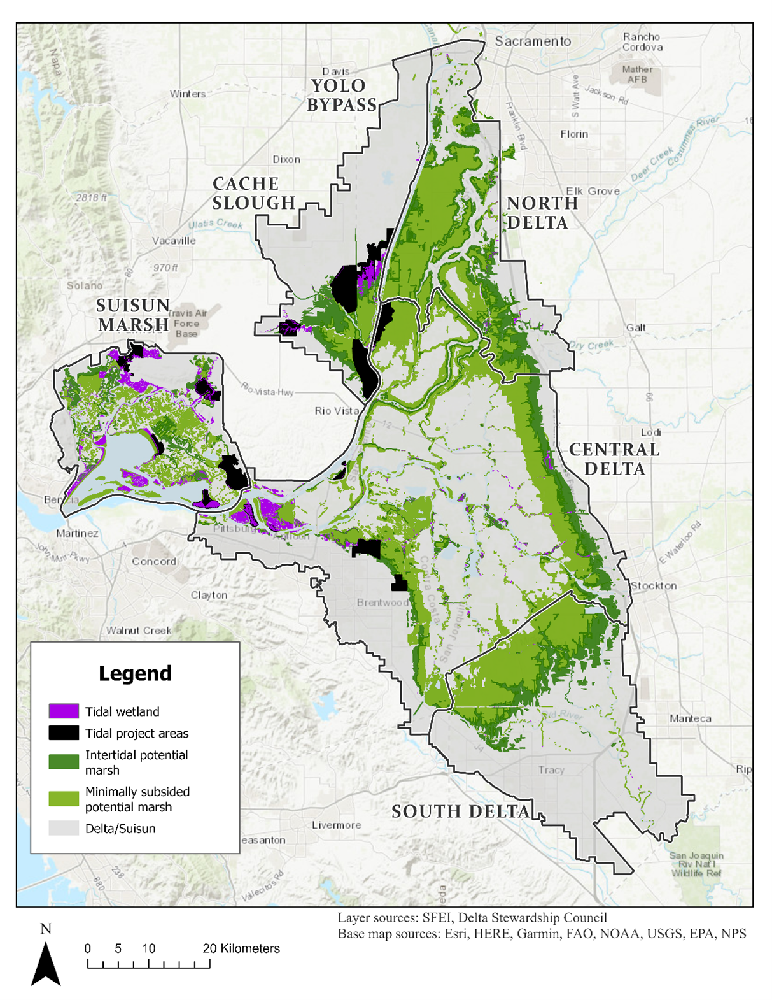
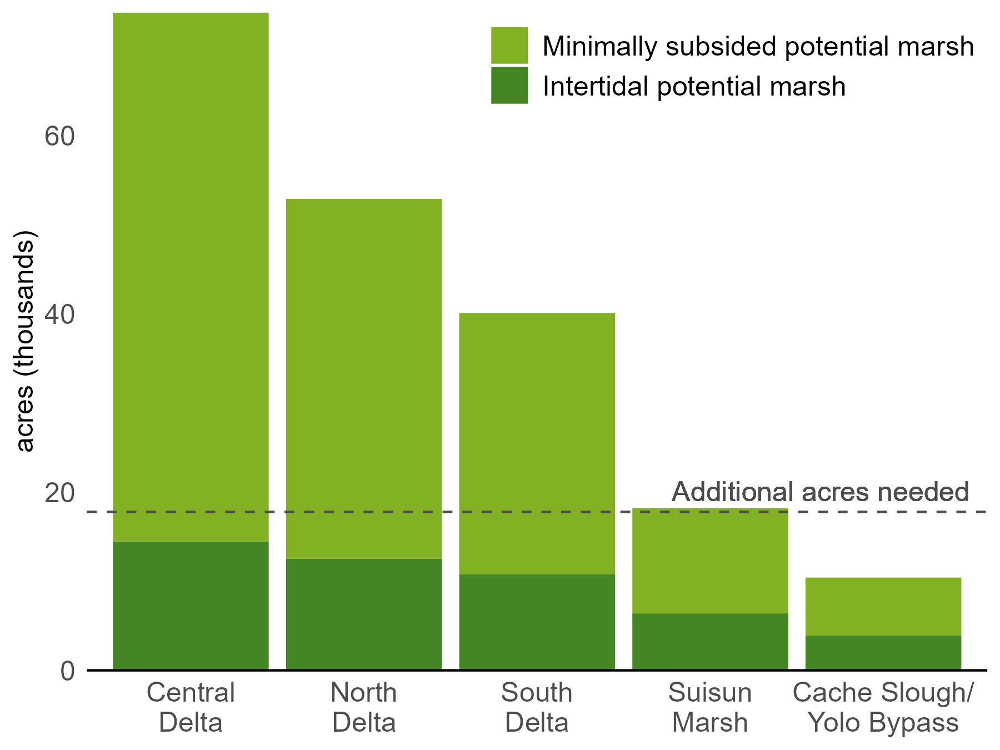

```{r, include = FALSE}
knitr::opts_chunk$set(
  collapse = TRUE,
  comment = "#>"
)
```

# Help Us Envision a Tidal Wetland Restoration Scenario

We are currently seeking input on approaches to developing tidal wetland restoration scenarios that meets Delta Plan target. We seek to represent the extent and possible spatial distribution of tidal wetlands once the restoration target is reached, to evaluate the potential benefits and trade-offs of meeting the target.

**Key Questions:**

-   Which planned or proposed restoration projects are not yet shown on our map? (see below)
-   Where are additional projects most (or least) likely? For example, what are the key constraints or priorities in terms of region, landowner, current landuse/land cover, or other factors?
-   What alternate strategies for meeting the Delta Plan target are under consideration? Are there alternate scenarios we should compare?

If you would like to contribute, please contact kdybala [at] pointblue.org!

# Projecting the Benefits of Tidal Wetland Restoration in the Delta and Suisun

To protect, restore, and enhance the Delta Ecosystem, the Delta Plan has defined targets for increasing the area of natural vegetation communities by 2050, including restoring more than 30,000 acres of tidal wetland habitat. Meeting this target is expected to support diverse populations of native species, improve ecological processes and functions, and enhance resilience to climate change, but the actual benefits of meeting this target are likely to depend on where and how tidal wetlands are restored.

We are leading research to estimate the potential benefits of tidal wetland restoration for the Delta’s bird community. This project builds on our flexible, open-source “Delta Multiple Benefits” framework for evaluating the benefits and trade-offs of landscape changes in the Sacramento-San Joaquin Delta. We are now beginning to develop scenarios representing different ways the Delta Plan’s tidal wetland restoration targets may be reached in the Delta and Suisun Marsh, including future projects currently in the proposal and planning stages and additional restored acres in plausible locations as needed to meet the target.

As of 2025, nearly half of the acres needed are either planned, in progress, or completed. Based on estimates of current intertidal and minimally subsided land, land with elevations potentially suitable for tidal wetland restoration are unevenly distributed among the regions of the Delta and Suisun Marsh:

```{r tidal_wetland_map, echo=FALSE, fig.cap="Map of potential tidal wetland, shown with existing tidal wetland and restoration projects planned, in progress, or completed", out.width = '80%'}

```

```{r potential_marsh, echo=FALSE, fig.cap="Potential suitable tidal wetland by region", out.width = '50%'}

```

*This project is supported by the California Department of Fish and Wildlife from the Water Quality, Supply, and Infrastructure Improvement Act of 2014 (Proposition 1, CWC § 79707), grant agreement number Q2296017.*
